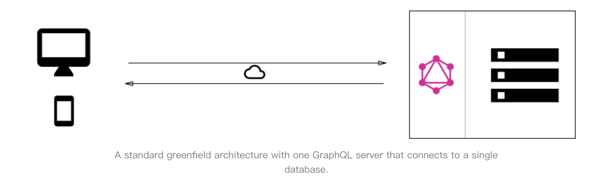
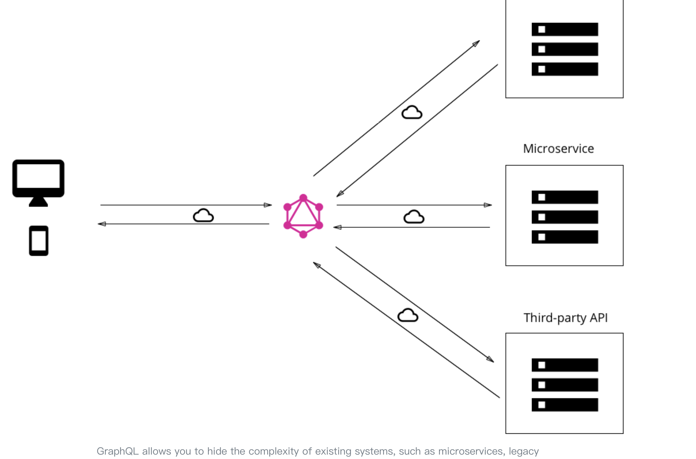
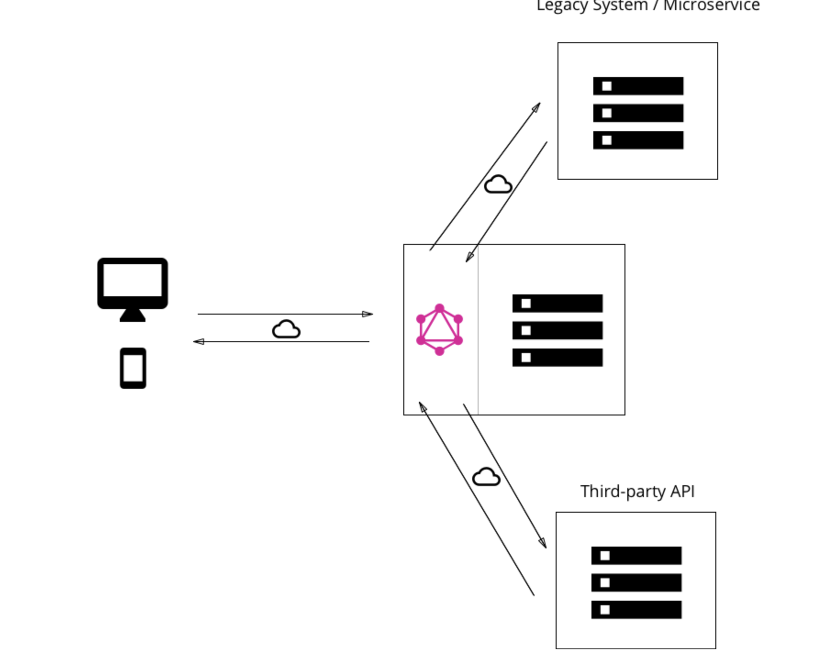
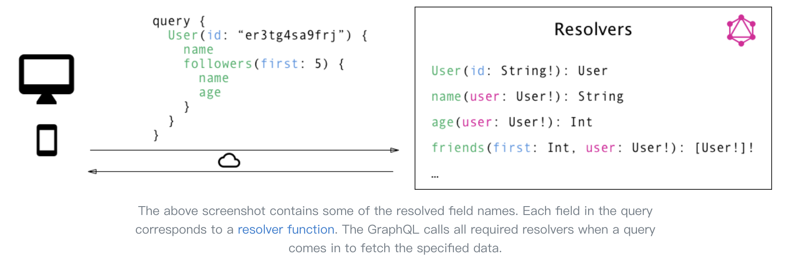

## What the GraphQL is

At its core, GraphQL is a Query Language for APIs that enables declarative data fetching where a client can specify exactly what data it needs from an API.

Instead of multiple endpoints that return fixed data structures, a GraphQL server only exposes a single endpoint and responds with precisely the data a client asked for.

## What are GraphQL Subscriptions?

Subscriptions are usually implemented with WebSockets, where the server holds a steady connection to the client. This means when working with subscriptions, we’re breaking the Request-Response cycle that is typically used for interactions with the API

#### core concept

1. Defining a Schema
   - define simple type declaration
   - realtionship between type declarations
   - query, mutation and subscription declaration
2. query request syntax
3. mutation request syntax
4. subscription request syntax

Server side implements those declaration and validating request parameters based on those declaration;
In Client side, using those declaration to mock data and take it as a self-documenting tools to reference.

`major change that’s introduced with GraphQL in going from a rather imperative data fetching approach to a purely declarative one`

reference as [Core Concepts](https://www.howtographql.com/basics/2-core-concepts/)

###### declaration elements

- query, mutation, and subscription
- Scalar types: String, Int, Float, Boolean and ID
- Object types
- Fragment
- Named Query Results with Aliases
- Enums
- Interface
- Union Types

## Pros VS Restful

- Overfetching: Downloading superfluous data
- Underfetching and the n+1 problem
- changes on the client-side can be made without any extra work on the server between interations
- Benefits of a Schema & Type System (SDL)

  > Once the schema is defined, the teams working on frontend and backends can do their work without further communication since they both are aware of the definite structure of the data that’s sent over the network.

  > Frontend teams can easily test their applications by mocking the required data structures. Once the server is ready, the switch can be flipped for the client apps to load the data from the actual API.

## Big Picture (Architecture)

#### use cases

1. GraphQL server with a connected database
   

2. GraphQL server that is a thin layer in front of a number of third party or legacy systems and integrates them through a single GraphQL API
   

3. A hybrid approach of a connected database and third party or legacy systems that can all be accessed through the same GraphQL API
   

#### Resolver functions

In the GraphQL server implementation, each of these fields actually corresponds to exactly one function that’s called a resolver. When the server receives a query, it will call all the functions for the fields that are specified in the query’s payload. Once all resolvers returned, the server will package data up in the format that was described by the query and send it back to the client.

## common issues

- How to do Server-side Caching?

- How to do Authentication and Authorization?

- How to do Error Handling?
